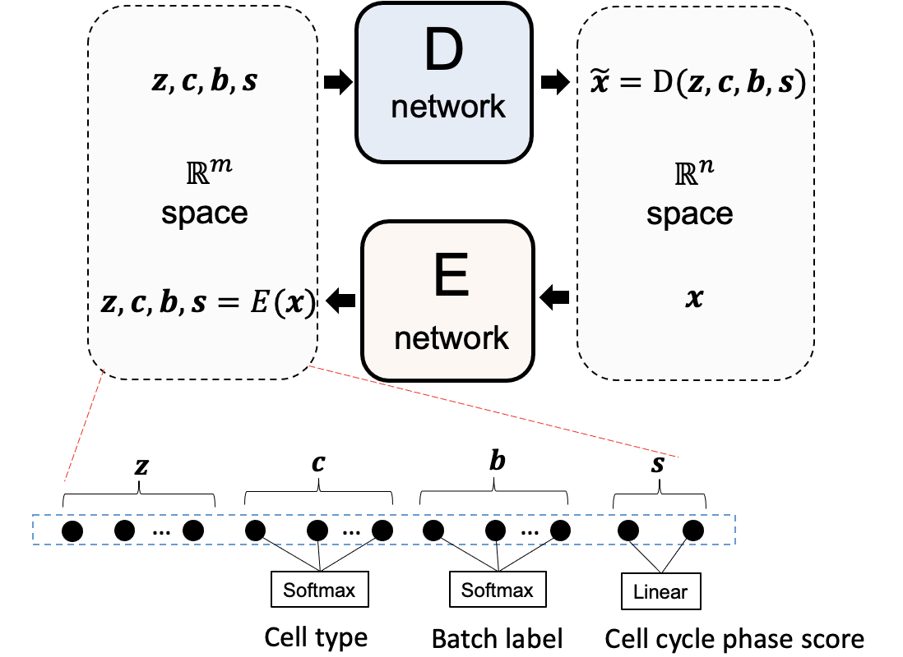

# JAE
Single cell joint embedding and modality prediction with autoencoder. JAE achieves the **first place** in [NeurIPS 2021 single cell competition](https://openproblems.bio/neurips_2021/) Joint Embedding tasks (see [Leaderboard](https://eval.ai/web/challenges/challenge-page/1111/leaderboard/2863),team: Amateur). This work was invited to give a talk at NeurIPS 2021 workshop (see slides [here](http://liu-q16.github.io/files/nips_competition.pdf)).

## Model description

JAE was inspired from our previous work [scDEC](https://www.nature.com/articles/s42256-021-00333-y) (Nat Mach Intell 3, 536–544, 2021). On the one hand, we simplified scDEC model by removing the discriminators, on the other hand, we add more constrains to the latent features where scDEC only requires latent features to recover cell type and JAE requires latent features to recover cell type, batch id, and cell cycle phase scores.

In brief, we built an autoencoder for joint embedding (JAE). Each modality will first be SVD transformed and concatenated together (denoted as x). The major difference from standard AE is that we incorporated the information from cell annotations (e.g., cell label, cell cycle score, and cell batch) to constrain the structure of latent features. We desire that some latent features (c) predict the cell type information, some features predict the cell cycle score. Noticeably, for feature (b), we want it to predict the batch label as randomly as possible to potentially eliminate the batch effect. z has no constrain at all to ensure the flexibility of neural network.

In the pretrain stage, JAE was trained with exploration data where the cell annotation information (cell type, cell cycle phase score) is available. In the test stage where the cell annotation information is not available, we only minimize the reconstruction loss of the autoencoder with a smaller learning rate (fine-tune).

## Environment

- Python == 3.9.0
- TensorFlow == 2.7.0
- cuda == 11.2.0
- cudnn == 8.1.1.33

## Model pretrain

**Step 1**: SVD transformation to each modality (except the ADT) for dimension reduction

One can run `python 1_pca_pretrain.py` to get the SVD transformation for each modality. Note that this SVD transformation was applied to aggregated dataset where only part of the cells were annotated.

**Step 2**: Autoencoder pretrain with regularizing latent features simulteneously

One can run `python 2_ae_pretrain_multiome.py` or `python 2_ae_pretrain_cite.py` to pretrain JAE with Multiome or CITE-seq data, respectively. The pretrained model weight file will be saved.

## Contact

Feel free to open a issue or contact liuqiao@stanford.edu if you have any problem.

## Citation

If you use JAE in your word, please kindly consider citing the following two works.

[1] Liu Q, Chen S, Jiang R, et al. Simultaneous deep generative modelling and clustering of single-cell genomic data[J]. Nature machine intelligence, 2021, 3(6): 536-544.

[2] Lance C, Luecken M D, Burkhardt D B, et al. Multimodal single cell data integration challenge: results and lessons learned[J]. bioRxiv, 2022.

